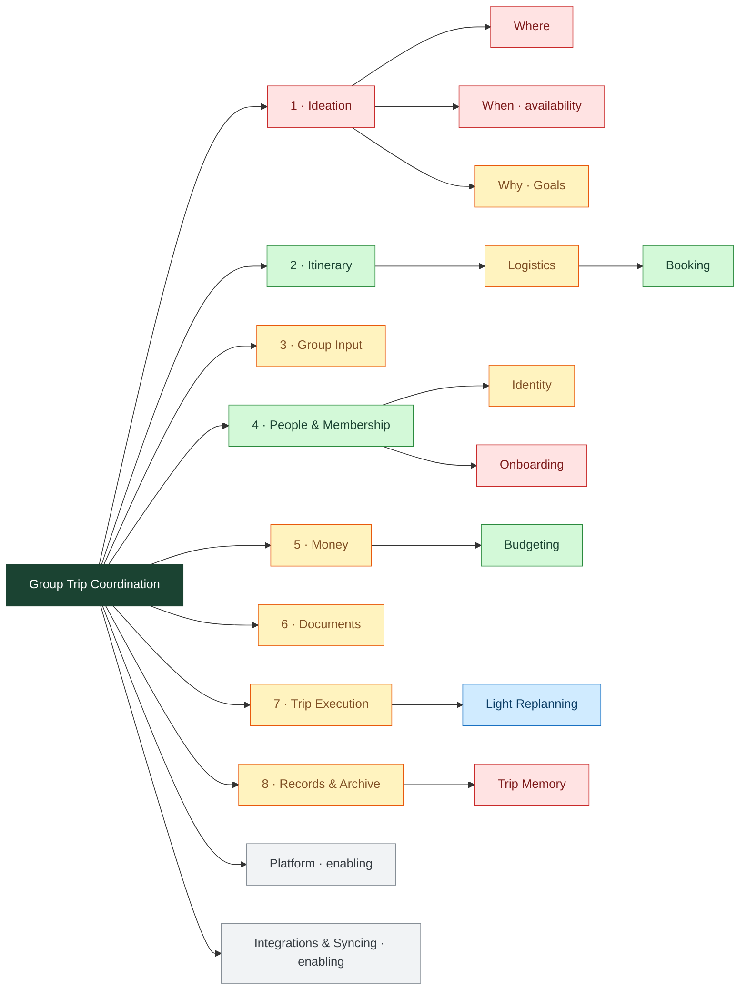

# Waypoint — Capability Map

> Canonical capability model: what Waypoint's capabilities are, what each is *for*, how mature it is, and how they compose.
> Capability-primary. **Supersedes the "Bounded Contexts" list in `CONTEXT.md`.** Product of a doc-grounded grilling walk (2026-06-20) **+ a 9-lens council review** (2026-06-21, report: `docs/CAPABILITY_MAP_REVIEW.html`).

## How to read

- **Tree:** root → **L1 capability** → **sub-capability** (→ sub-sub where useful). Every node has an **outcome**; outcomes roll up to the root thesis.
- **6 facets per capability:** Outcome · Sub-capabilities · Data · Applications/Services · Business processes · Roles.
- **Modeling rules (earned in the walk):** data objects ≠ sub-capabilities; a **sub-capability** earns it with a **distinct outcome**; a **process** is a step within a parent's outcome; an **application** composes data objects; capabilities **own** or **borrow** (🔗) data.
- **Maturity (capabilities):** 🟢 mature · 🟡 building · 🔵 planned · 🔴 gap · ⚪ enabling.
- **Data status (as-built vs as-intended — council rec #1):** every Data object is tagged **🟢 shipped** (collection/field exists today) or **🔵 planned** (mapped target, not built). **ADR accepted ≠ shipped.**

## The map

**8 core + 2 enabling.** Lifecycle reads left-to-right as an overlay; the spine is capability, not time.

## Keystone primitives (the cross-cutting graph)

Capabilities that **own** primitives the rest of the app composes from:

- **Itinerary → `Item`** 🟢 — keystone *entity*; borrowed by Money (`linked_item`, cost), Documents, Group Input (votes/suggestions), Membership (`assigned_to`), and the Logistics sub (`booked`). Most overloaded surface in the app — **hold a high bar before attaching more.**
- **Group Input → the `Vote` + `Comment` mechanisms** — *not one aggregate.* The Vote pattern is reused across **three intentionally-separate collections** (`votes` 🟢, `goal_votes` 🟢, `suggestion_votes` 🟢 — kept separate per ADR-0004/0009, **do not merge**). **`Comment` is 🔵 latent:** today it's a `suggestions` row (item-only); a polymorphic `comments` collection is the planned target.
- **People & Membership → `Member` + `Role`** 🟢 — people-source + access primitive; borrowed everywhere.
- **Itinerary → `Checklist` + `Task`** 🟢 — a standalone primitive (ADR-0003), not an Item; **keystone-tier**. Attaches to trip/phase/item; the Logistics sub builds on it (booking, packing, readiness).

**Not a capability — a data type:** **Saved Reference** 🔵 (a public/general external link; the manual twin of Integrations' enrichment; distinct from a trip-private Document).

## Provenance & code reconciliation (council rec #4)

Old `CONTEXT.md` "Bounded Contexts" → this map, with **why each L1 exists** (earned-by-outcome vs inherited-from-code-folder):

| Old context | → Capability | Provenance |
|---|---|---|
| Itinerary | **Itinerary** (+ **Logistics** sub) | earned-by-outcome |
| Collaboration | **Group Input** + **People & Membership** (comments→Group Input, notifications→Platform) | earned-by-outcome (split) |
| Trip Mode | **Trip Execution** | earned-by-**outcome** (council urged demoting to a "Mode" on zero-data grounds; **retained as L1** — the in-the-moment/offline outcome is distinct, per our distinct-outcome rule) |
| Archive & Portability + Trip Memory | **Records & Archive** (Trip Memory = sub) | earned-by-outcome |
| Shell | **Platform** | enabling |
| (Documents) | **Documents** | earned-by-outcome |
| (Logistics) | folded → **Itinerary / Logistics sub** | *was* inherited-from-`lib/itinerary/`; demoted per council rec #8 |
| Vault | retired (ADR-0005) | — |

⚠ **Code smell to fix (not a map change):** `lib/collaboration/` spans **3** capabilities (voting → Group Input; member-avatar → Identity). A `lib/` split should follow this map.

---

## Root · Group Trip Coordination
**Thesis:** *the home for a group trip — everything a group needs to **plan, execute, and remember** it, so nothing forces anyone back to the Doc / Sheet / Splitwise / group-text stack.* Solo → 12+ people. Realized by the Waypoint PWA (SvelteKit + PocketBase).

## 1 · Ideation 🔴 *gap*
**Outcome:** the group decides **where, when, and why** we're going — enough to commit to dates. *(Where/When resolve at trip creation → Itinerary; Why persists as Goals.)*
**Sub-capabilities:** **Where** 🔴 · **When + availability** 🔴 · **Why — Goals** 🟡
**Data:** Proposal 🔵 (polymorphic candidate) · Candidate Scenario 🔵 (a bundle weighed as one) · **Availability** 🔵 (a *4th mechanism*: member × date-range → yes/maybe/no overlap — explicitly **not** a Vote) · pros/cons 🔵 · Goal 🟢 (`trip_goals`). *Borrows the propose→vote/discuss→promote engine + the Vote mechanism (Group Input); consumes Saved References.*
**Applications/services:** comparison/decision board · route-builder · availability poll · capture (via Saved References).
**Business processes:** capture → propose → weigh (vote + availability + pros/cons) → select → **promote** into dates / phases / items / budget.
**Roles:** flat & fluid **participants** (initiator + respondents; no role ladder, no tombstone on leave).
**Frontier:** the whole capability is largely unbuilt — only Goals exist. The pre-dates "where/when should we go" phase has no home today.

## 2 · Itinerary 🟢 *mature*
**Outcome:** a shared plan, built and made ready, where nothing's lost between idea and trip day.
**Sub-capabilities:** **Logistics** 🟡 (absorbed from the old L1 — see below). Trip structure, Items, Parking Lot, Scheduling are facets, not subs.
**Data:** `trips` 🟢 · `phases` 🟢 · `days` 🟢 · **`items`** 🟢 🔗 (keystone) · `cost_estimate_usd` on Item 🟢 (read by Money). *Dead/inert fields (not present-tense): `booked_by`, `paid_by`, `cost_actual_usd` — deprecated ghosts.*
**Applications/services:** `/trips/[slug]` · `/phases[/phaseId]` · `/days/[dayId]` · `/items/*` · Planning-Mode nav. (Enrichment → Integrations.)
**Business processes:** create dated trip → create phases/days/boundaries → manage items in days → manage unplanned items in phase/day → promote unplanned → planned.
**Roles:** owner/co-owner edit · traveler suggests (immediate for own items + self-assign) · viewer reads.

### 2a · Logistics 🟡 *(sub-capability of Itinerary)*
**Outcome:** the planned trip gets **ready for trip day** — booked, packed, confirmed, travel choreography known. *(Demoted from L1 per council rec #8 — its code lives in `lib/itinerary/`; the "ready by trip day" outcome survives as a sub.)*
**Sub-capability:** **Booking** 🟢 (mark `booked`; the booking smart list).
**Data:** `checklists` 🟢 · `tasks` 🟢 (the Checklist/Task primitive, ADR-0003; borrows **Member** as assignee). *Borrows:* Item+`booked`, paid (Money), docs (Documents), flight/transport + member travel.
**Applications/services:** `/lists`[`/id`] · `/lists/booking` · **Travel view** (`/lists/flights`, broadened: who's arriving/leaving when) · **Item readiness rollup** (per-item *booked·paid·documented*).
**Business processes:** manage checklists/tasks · **booking lifecycle** (identify what needs booking → get details → book → record confirmation [Documents] and/or payment [Money]) · **item readiness** (umbrella: booked✓ paid✓ documented✓; Booking is its first third) · travel-choreography awareness. *(This end-to-end booking flow is the distinct logistics outcome that earns Logistics its sub-capability spot.)*
**Roles:** checker/doer (traveler+) · assignee · viewer.

## 3 · Group Input 🟡 *building*
**Outcome:** every member can make their opinion, thoughts, questions, and preferences known — fast (vote) or in depth (comment) — and the group's input converges into the plan.
**Sub-capabilities:** none.
**Data:** **`Vote` mechanism** across `votes` 🟢 / `goal_votes` 🟢 / `suggestion_votes` 🟢 (3 separate, ADR-0004/0009) · **`Comment`** 🔵 latent (today a `suggestions` row, item-only; polymorphic `comments` collection planned) · proposed/ghost **Item** (`suggestions` 🟢; votable ghost-card UI 🔵, #202). *Vote does **not** cover date availability — see Ideation's Availability.*
**Applications/services:** vote buttons · comment threads · swipe-quiz *(no comment pathway yet — frontier)* · review inbox.
**Business processes:** express (quick vote / comment / swipe) · contribution loop (propose → vote/discuss → owner promotes → real item).
**Roles:** proposer · owner (promote gate) · rest-of-group (everyone incl. viewers can comment; travelers+ vote/propose).
**Frontier:** ghost-card contribution loop (#202) · swipe comment pathway · extract `comments` to a polymorphic collection.

## 4 · People & Membership 🟢 *mature*
**Outcome:** the right people are on the trip with the right access and a recognizable identity — and the who-did-what record survives joins, claims, and departures.
**Sub-capabilities:** **Identity** 🟡 (`/account`, avatars, display names; user-level, persists across trips) · **Onboarding** 🔴 (the first-five-minutes: join/claim → trip home → first contribution; D2 / #111) — home confirmed here (a new member's entry, not the Platform shell).
**Data:** **`Member`** 🟢 🔗 (`trip_members`, keystone) · **`Role`** 🟢 🔗 · `pending_invites` 🟢 · `join_tokens` 🟢 · tombstone fields 🟢 · `users.avatar` 🟡 / `display_name` 🟢 (Identity).
**Applications/services:** `/members` · `/settings` · `/invite/[code]` · `/join/[token]` · `/claim` · `/account`. Invite/OTP email → Integrations (Resend).
**Business processes:** invite-by-email · invite-by-link · claim · promote role · remove → tombstone · self-leave.
**Roles:** owner (admits/assigns/removes, irremovable) · co-owner · inviter (traveler+) · incoming · managed member.
**Frontier:** self-leave UI · avatar polish · Onboarding (mostly unbuilt).

## 5 · Money 🟡 *building*
**Outcome:** no one returns to Splitwise — everyone knows what they owe, what's been spent, and what they have left, and the group settles fairly.
**Sub-capabilities:** **Budgeting** 🟢 (forward control; owner-only).
**Data:** `expenses` 🟢 (borrows **Item** 🔗 + **Member** 🔗) · `settlements` 🟢 · `trip_budgets` 🟢 · **Glance** 🟢 (derived "what I have left", Money-owned, surfaced by Trip Execution) · **Money Unit** 🔵 (no collection yet, #230) — a Money-owned grouping that **references `Member` 🔗 (never a second member store)** and **resolves on tombstone (ADR-0008)**; not a keystone. *Borrows the **Comment** mechanism (comments on an expense).*
**Applications/services:** `/expenses` · `/budget` · Trip-Mode `/money` (the glance) · debt-simplification service.
**Business processes:** log expense + split · **Paid Moment** 🔵 (log payment prefilled from an item; → receipt in Documents) · **settle up** · set/adjust budget · check the glance.
**Roles:** payer · participant · settler · money unit · budget-owner.
**Frontier:** Paid Moments (#229, ADR-0014) · Money Units (#230, ADR-0015) · glance polish.

## 6 · Documents 🟡 *building*
**Outcome:** every booking reference — file **or** code — is one tap away; never dig the group text.
**Sub-capabilities:** none.
**Data:** **File artifact** (`documents`) 🟢 · **Confirmation code** 🔵 (**still on `items.confirmation_codes` today**; moves into Documents per ADR-0016 — migration pending). Both scope to an Item or the Trip. Borrows **Item** 🔗 + **Member** 🔗.
**Applications/services:** the Documents window on the item card · `/documents` (Trip Documents aggregate) · `/documents/[docId]/file`.
**Business processes:** upload · paste (🔵 #73) · scope to item/trip · view/preview (🔵 #72) · delete · offline-precache (🔵 #74).
**Roles:** uploader (traveler+) · viewer (everyone) · deleter (uploader, or owner/co-owner).
**Frontier:** codes migration (ADR-0016) · paste · preview · offline precache · expense-scoped receipts.

## 7 · Trip Execution 🟡 *building*
**Outcome:** on the trip, you always know what's now and next, can act one-handed, and it works without signal. *(Retained as L1 despite council rec #7 — it earns its spot by **outcome**, not by owned data.)*
**Identity:** the **live lens** — owns **zero native data**; pure surfaces + process over borrowed data.
**Sub-capabilities:** **Light Replanning** 🔵 (manage the *unplanned/unexpected*; promote a parked idea, skip/swap; #166).
**Data:** none native. *Borrows:* Itinerary (items/days), Money (Glance), Documents (offline confirmations), parking lot, Platform (offline cache).
**Applications/services:** `/now` · `/today/upcoming` · `/money` (Money's glance) · Add FAB · mode-switch pill.
**Business processes:** auto-activate by date · view Now (Focus: ongoing / free-time / day-wrapped) · **Add workflow** (live quick-capture → item / expense / document) · offline read.
**Roles:** member-in-the-moment (edits traveler+; viewer read).
**Frontier:** Light Replanning doors (#166) · offline completion (#203).

## 8 · Records & Archive 🟡 *building*
**Outcome:** the trip ends well and lives on — a **private keepsake** for the travelers and a **public record** for the world — and the data stays yours to keep and reuse.
**Sub-capabilities:** **Trip Memory** 🔴 (private, members-only; one photo + one thought per member per day; captured during the trip + at closeout; **unbuilt — no `memories` collection**).
**Data:** Memory 🔵 (`memories`, unbuilt) · archive publish-state (`trips.archived` 🟢, `archive_publish_at` 🟢, token 🟢) · Export 🟢 (derived). *Borrows:* Items/days, Members.
**Applications/services:** `/closeout` · `/archive/[token]`(+`/export`) · `/clone` · `/export` · archive-view + export/import.
**Business processes:** **Closeout** (done/considered walk) · **Wrap-up state** (post-end orchestration: triggers settle → closeout → publish) · publish · export/import/clone · author memory.
**Roles:** owner/co-owner (closeout, publish) · member (authors own memory) · public (views archive).
**Frontier:** Trip Memory (unbuilt) · wrap-up completion (#195).

---

## Enabling · Platform ⚪
**Outcome:** the invisible floor every capability stands on — signed in, loads, works offline, navigates, keeps time.
**Data:** `users` 🟢 🔗 · `notifications` 🟢 · service-worker cache 🟡.
**Services:** Auth (email+OTP) · PWA (service worker, A2HS, offline) · Navigation (mode-aware nav, transitions; hosts Trip Execution's Now/Today nav surfaces) · Design tokens · Trip clock · **Notifications** (in-app bell).

## Enabling · Integrations & Syncing ⚪
**Outcome:** Waypoint plays well with the outside world — pull data in, push out, link across — so the trip isn't an island.
**Services (connectors):** Place enrichment (Google Places) 🟢 · Flight enrichment (AeroDataBox) 🟢 · **Email delivery (Resend)** 🟢 — consumed by Platform (OTP) + Membership (invites) · Map linkouts 🟢 · Photo-album linkout 🟢 · Calendar sync 🔵 · **Weather** 🔵 (committed in backlog; packing + Now forecast) · **Email Digest** 🔵 (outbound "what changed" — highest-leverage absence vs the "non-technical friend uses it" bar) · Umami analytics 🔵.

---

## NOT on the map (boundary — points to charter, not mirrored)
Off the table per the charter & `CLAUDE.md`: multi-currency · push notifications · embedded maps · real-time co-editing · native apps · AI-generated itineraries · trip-level messaging beyond comments. **Emotional register:** anticipation/hype is welcome (e.g. a trip **countdown** on the landing / trip-home) but **never via push** — in-app only. *(See `docs/agents/charter.md` for the authoritative NOT-list; this is a pointer.)*

## Open seams (🔴 hand-offs that drop data — notes, not capabilities)
- **Onboarding / first-five-minutes** (D2, #111) — a sub-capability under People & Membership.
- **Pre-trip soft-commit** — Ideation → Itinerary hand-off; no dated-trip-draft today.
- **Phase → phase idea hand-off** — parked ideas can become unreachable when a phase ends mid-trip.

## Maturity at a glance
- **🔴 gaps:** Ideation (where/when), Trip Memory, Onboarding.
- **🔵 planned on mature trunks:** Money (Paid Moments, Money Units), Documents (codes migration, paste/preview/offline), Trip Execution (Light Replanning, offline), Group Input (contribution loop, polymorphic comments), Logistics (readiness rollup, travel view), Integrations (Weather, Email Digest, calendar).
- **🟢 done & stable:** Itinerary core, People & Membership core, Money core, Group Input voting, Records archive/closeout.
- **Over-development smell:** the keystone **`Item`** (6 capabilities on one surface). Itinerary is **intentionally the largest** — it *is* "the plan" (structure + items + scheduling + logistics/prep), inherently broad; its size is by design, not catch-all.

## Council disposition (2026-06-21)
9 recommendations, all skeptic-confirmed. **Applied:** #1 status discipline · #2 Group Input mechanisms · #3 Availability · #4 provenance/code-reconciliation · #5 Weather+Email Digest · #6 NOT-list pointer + seam notes (onboarding promoted to a sub-capability) · #8 Logistics → Itinerary sub · #9 Money Unit references-not-overrides. **Rejected:** #7 (Trip Execution demotion) — kept L1 by outcome. Full report + skeptic verdicts: `docs/CAPABILITY_MAP_REVIEW.html`.

**Pass 2 — opportunity horizon (2026-06-21, `docs/CAPABILITY_MAP_REVIEW_2.html`):** 20 opportunities (11 skeptic-backed); the revision was confirmed sound. **Adopted:** **Onboarding** as the NOW next-build (reuses Join Link #118 + the `/goals` deck); the **date-finding wedge** ("the poll is the invite" — Ideation When/Availability) as the headline opportunity; an **anticipation countdown** on the landing / trip-home; and **local-AI *assist* surfaces** (sentiment summary, packing-list draft, booking-extraction-from-email, conflict surfacing, "when's our flight", expense categorization) — endorsed **pending a zero-code AI-assist posture ADR** (local-first; must precede any AI surface). **Rejected:** dissolving the **Logistics** sub — kept, its booking lifecycle is a distinct logistics outcome.

## Provenance
Derived from `CONTEXT.md`, `docs/agents/charter.md`, `docs/SPEC.md`, the 14 PRDs, the 15 ADRs, the `docs/app-audit/`, a 2026-06-20 code sweep, a capability-by-capability grilling walk, and the 2026-06-21 council review.
